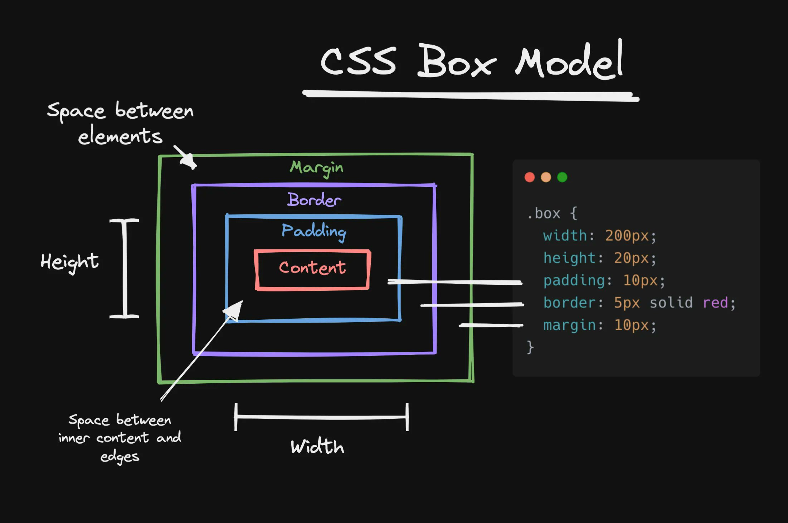

                                           
# Learn CSS (Cascading Style Sheets)      

# What is CSS?     
### CSS stands for Cascading Style Sheets.  It's a computer language specifically used to style and layout web pages.  Imagine CSS as the makeup for websites!  It allows you to change the fonts, colors, and layout to create a visually appealing website.

# Here are some familiar terms to get you comfortable before starting CSS:       

1. CSS (Cascading Style Sheets): A language used to describe the style of HTML documents.
2. Selector: The part of a CSS rule that specifies which HTML elements the styles apply to.
3. Property: An aspect of the HTML element you want to change, like color or font size.
4. Value: The setting you want to apply to the property, like "blue" or "16px".
5. Declaration: A combination of a property and a value.
6. Declaration Block: A group of declarations enclosed in curly braces.
7. Rule: A selector followed by a declaration block.
8. Inline Style: CSS written directly in the HTML element using the style attribute.
9. Internal Style Sheet: CSS written inside a `
          </head>
          <body>
            
This is a green paragraph.

          </body>
          </html>
          
*Example 3: External CSS*

          <!DOCTYPE html>
          <html>
          <head>
            <link rel="stylesheet" href="styles.css">
          </head>
          <body>
            
This is styled from an external CSS file.

          </body>
          </html>
          
In the styles.css file:

          p {
            color: purple;
            font-size: 22px;
          }

# B. CSS Selectors
Selectors are used to target HTML elements to style them. Here are some common types of CSS selectors:

### Element Selector: Targets an element by its tag name.

    p {
      color: blue;
    }
This will style all 
 tags.

### Class Selector: Targets elements with a specific class.

      .my-class {
        color: red;
      }
      HTML:
      
This text is red.

      
### ID Selector: Targets an element with a specific ID.

      #my-id {
        color: green;
      }
      HTML:
      
This text is green.

Universal Selector: Targets all elements on the page.

      * {
        color: black;
      }
Grouping Selectors: Combine multiple selectors to apply the same styles.

      h1, h2, h3 {
        color: purple;
      }
Descendant Selector: Selects elements inside another element.

      div p {
        color: blue;
      }

# C: Box Model

Everything in HTML is a box, and CSS controls how these boxes are displayed. The box model consists of:

1. Content: The actual content of the element (text, image, etc.).

2. Padding: Space between the content and the border.

3. Border: The line surrounding the element.

4. Margin: Space between the border and adjacent elements.

    
Here’s a diagram of the box model:

CSS Example with Box Model:

    div {
      width: 200px;
      height: 20px;
      padding: 10px;
      border: 5px solid red;
      margin: 10px;
    }

# D: Positioning Elements

CSS allows you to control the layout and positioning of elements with various properties.

Positioning Types:

  1. Static (default): Elements flow in the document as they normally would.
      
         div {
           position: static;
         }
  2. Relative: The element is positioned relative to its normal position.
   
         div {
           position: relative;
           top: 10px;
           left: 20px;
         }
  3. Absolute: The element is positioned relative to its closest positioned (non-static) ancestor.
    
           div {
             position: absolute;
             top: 50px;
             right: 30px;
           }
  4. Fixed: The element is positioned relative to the viewport (browser window).
     
           div {
             position: fixed;
             bottom: 0;
             right: 0;
           }
  5. Sticky: The element is treated as relative until it reaches a defined scroll position, after which it becomes fixed.
    
           div {
             position: sticky;
             top: 0;
           }

# E: Flexbox
Flexbox is a layout model that allows you to create flexible and responsive layouts. It works by assigning a container to use display: flex; and then controlling the alignment, direction, and spacing of items inside it.

Flexbox Basic Setup:

      .container {
        display: flex;
        justify-content: space-between; /* Align items horizontally */
        align-items: center; /* Align items vertically */
      }
      
      .item {
        flex: 1; /* Each item takes equal space */
      }

      
Example:

    

      
Item 1

      
Item 2

      
Item 3

    

# F: Responsive Design with Media Queries
Responsive design adjusts the layout based on the device’s screen size. You can use media queries to apply different styles for different screen sizes.

Example:

        /* For devices with a max width of 600px */
        @media only screen and (max-width: 600px) {
          .container {
            flex-direction: column; /* Stacks the items vertically */
          }
        }

# Where can I start learning CSS?

### 1. [FreeCodeCamp](https://www.freecodecamp.org/)
### 2. [MDN Web Docs (Mozilla)](https://developer.mozilla.org/en-US/docs/Web/CSS)
### 3. [CSS-Tricks](https://css-tricks.com/)
### 4. [The Odin Project](https://www.theodinproject.com/lessons/foundations-intro-to-css)
### 5. [CSS Grid Garden](https://cssgridgarden.com/)
### 6. [Flexbox Froggy](https://flexboxfroggy.com/)
### 7. [W3Schools](https://www.w3schools.com/css/default.asp)
### 8. [YouTube: Traversy Media](https://www.youtube.com/watch?v=yfoY53QXEnI)
***There are plenty of great resources out there!
